# Mac mini (M1, 2020)
- チップ    Apple M1
- メモリ    16 GB
## Application
- Authy Desktop
- Google Chrome
- Google Japanese Input
  - Set [keymap.txt](./keymap.txt)
    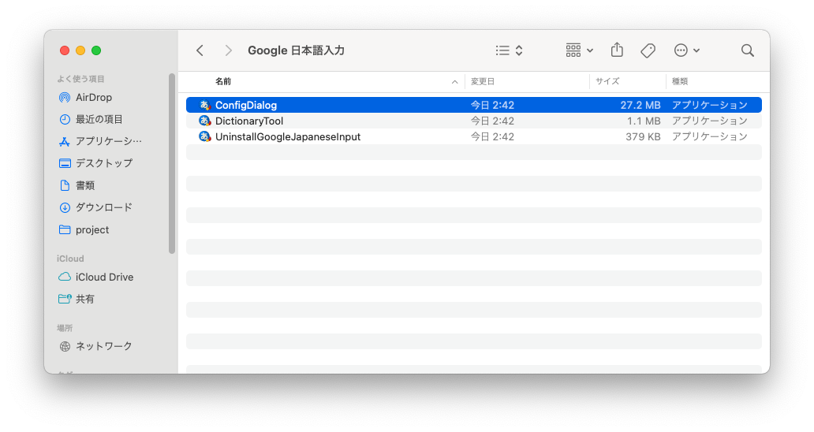
    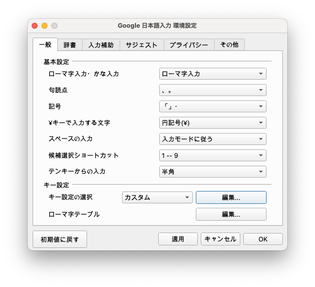
    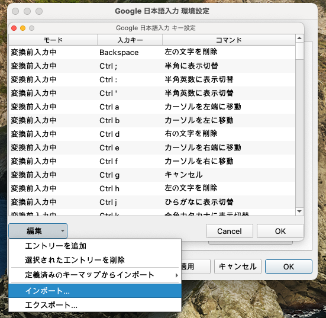
- Logi Options
  - Set Custom Button
    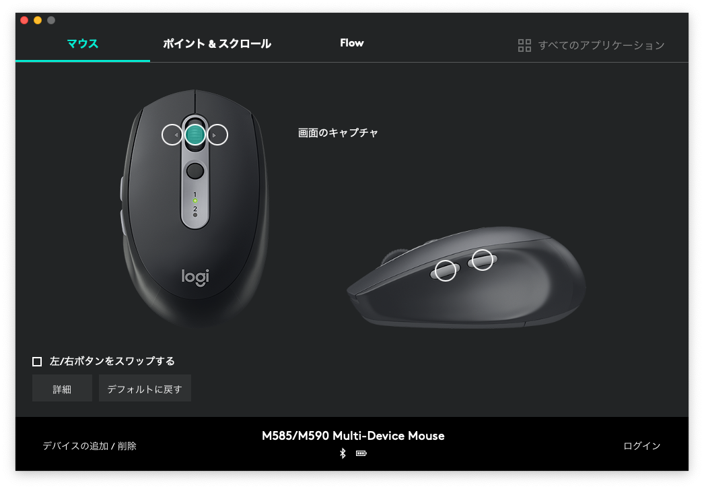
    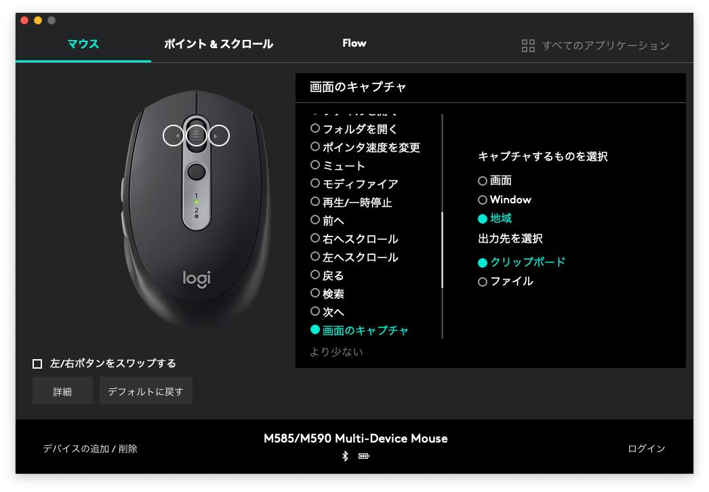
    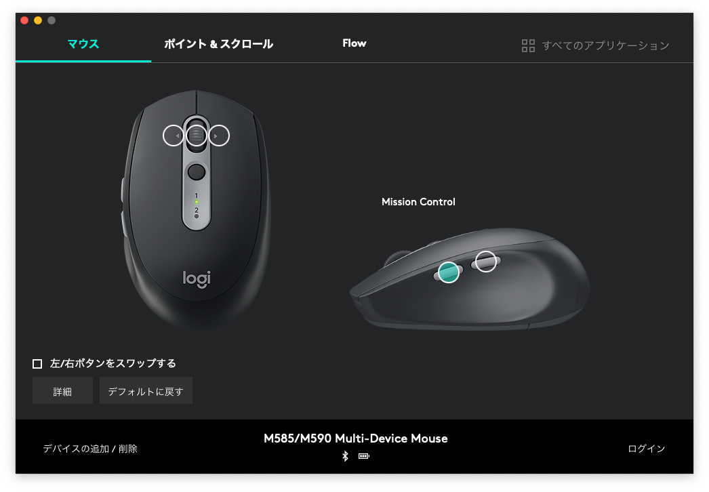
- Visual Studio Code
  - `>Shell Command: Install 'code' command in PATH`
  - `>Preferences: Open User Settings`
    - delete `**/.git` in `Files: Exclude` 
## System Preference
### Desktop & Screen Saver
#### Hot Corner

#### Desktop
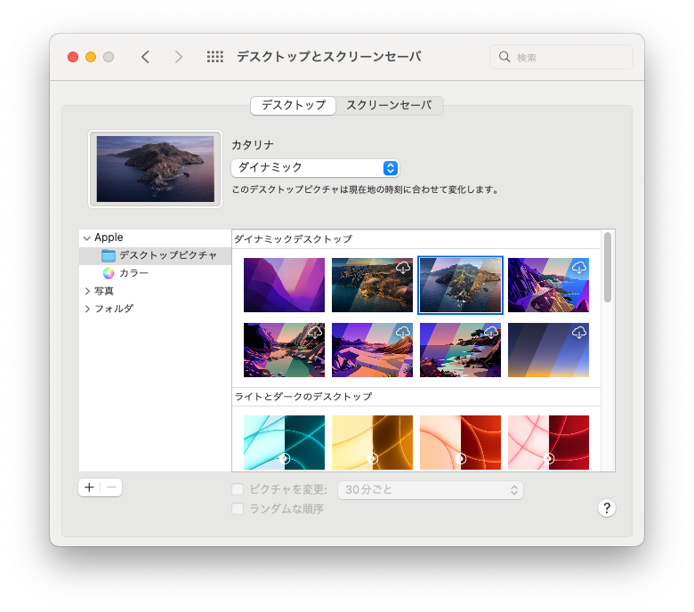
### Keyboard
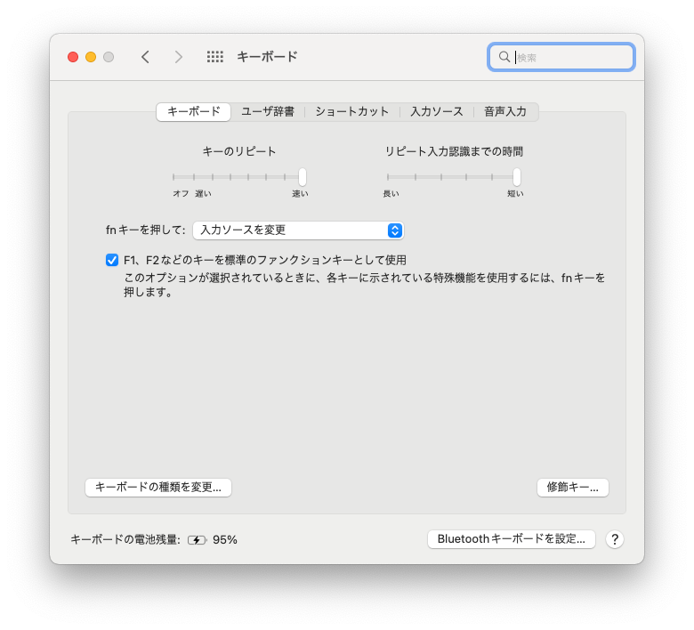
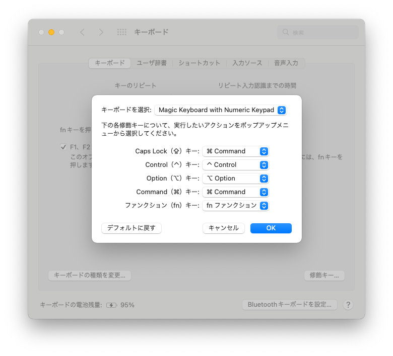
## dotfiles
```
mkdir -p ~/project/tanjo
git clone https://github.com/tanjo/dotfiles.git
```
### Copy
```
cp .bash_profile ~
cp .bashrc ~
cp .zshrc ~
cp .gitconfig ~
cp .gitignore ~
```
## Terminal

### Import *Custom.terminal*

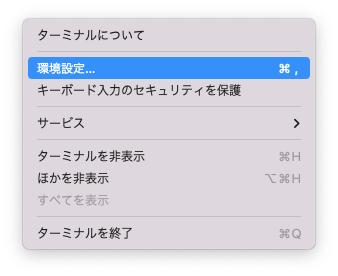
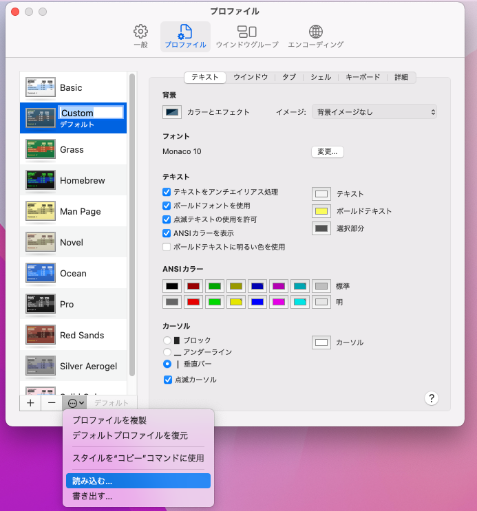
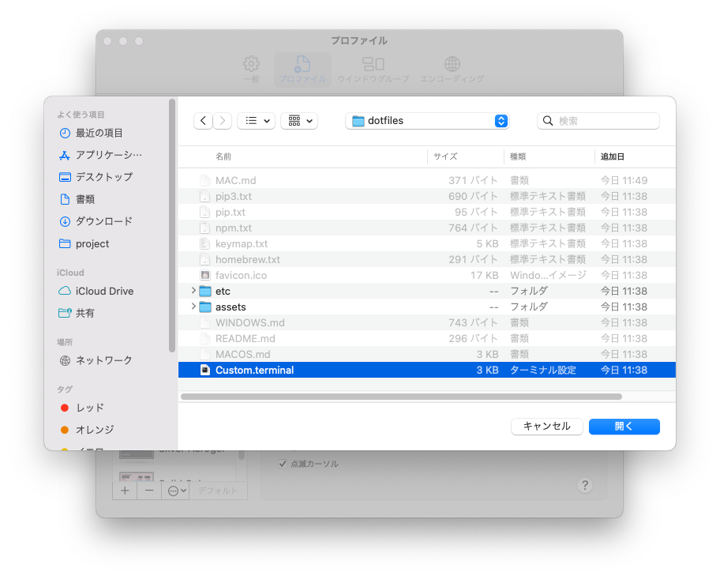

### Set Default

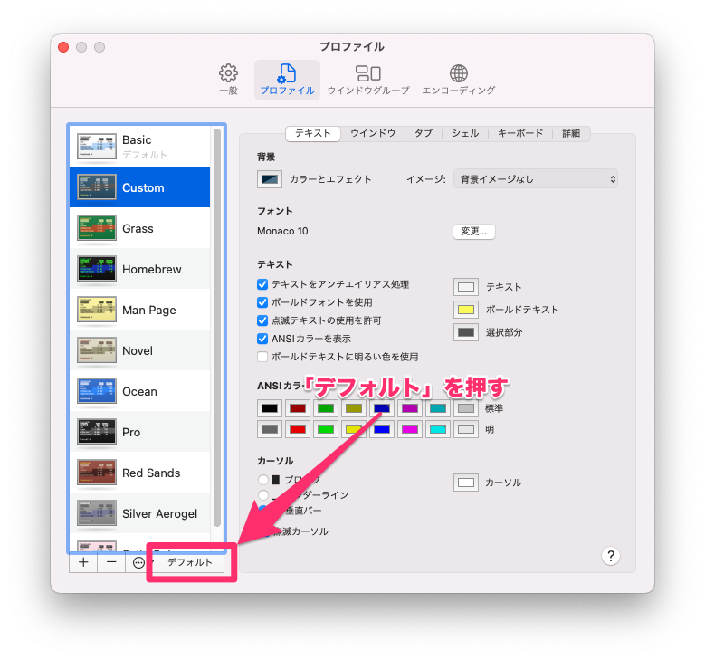

## Homebrew
- [Homebrew — macOS 用パッケージマネージャー](http://brew.sh/index_ja.html)
### Install
```
 /bin/bash -c "$(curl -fsSL https://raw.githubusercontent.com/Homebrew/install/HEAD/install.sh)"
```

```
 echo 'eval "$(/opt/homebrew/bin/brew shellenv)"' >> /Users/tanjo/.zprofile  
 eval "$(/opt/homebrew/bin/brew shellenv)"                    
```

### Install list
- [homebrew.txt](homebrew.txt)

```
brew leaves > homebrew.txt
```

## Node.js

```
brew install node
```

### Install list
- [npm.txt](npm.txt)
```
npm ls -g --depth=0 > npm.txt
```

### Global install

- [trash-cli](https://github.com/sindresorhus/trash-cli)

```
npm install --global trash-cli
```

## GitHub

### hub

- [github/hub](https://github.com/github/hub)

### ~/.config/hub

```yaml
github.com:
- user: tanjo
  oauth_token: [GitHubのパーソナルアクセストークン]
  protocol: https
```

### SSH

- [Generating a new SSH key and adding it to the ssh\-agent \- User Documentation](https://help.github.com/articles/generating-a-new-ssh-key-and-adding-it-to-the-ssh-agent/)

```
mkdir -p ~/.ssh/github/tanjo/
ssh-keygen -t ed25519 -C "tanjo@users.noreply.github.com" -f ~/.ssh/github/tanjo/id_rsa
eval "$(ssh-agent -s)"
ssh-add -K ~/.ssh/github/tanjo/id_rsa
```

#### Adding a new ssh

```
pbcopy < ~/.ssh/github/tanjo/id_rsa.pub
```

https://github.com/settings/keys

```
Host github.com
 HostName     github.com
 AddKeysToAgent yes
 UseKeychain yes
 IdentityFile ~/.ssh/github/tanjo/id_rsa
 TCPKeepAlive yes
 IdentitiesOnly yes

Host tanjo
 HostName     github.com
 AddKeysToAgent yes
 UseKeychain yes
 IdentityFile ~/.ssh/github/tanjo/id_rsa
 TCPKeepAlive yes
 IdentitiesOnly yes
```

## HTTPS -> SSH

```
git remote set-url origin git@github.com:tanjo/dotfiles.git
```

## Slack

### Sidebar Theme

```
#343A39,#82808A,#8EBDDF,#E8E8E9,#0881C7,#E8E8E9,#E8E8E9,#F2DAD8
```

### Download

- [iTunes](https://itunes.apple.com/jp/app/slack/id803453959?mt=12)

## Screenshot

### Mac Screenshot location

```sh
mkdir -p ~/Pictures/Screenshot
defaults write com.apple.screencapture location ~/Pictures/Screenshot/
killall SystemUIServer
```

## MEMO

- `.localized` という空のファイルを作成すると日本語になる.
- `.com.apple.timemachine.supported` は Time Machine 関連のファイル.
- 主な開発は `~/project` で行う.
- `sudo xcodebuild -license` が要求されることがある.
- `git submodule update --init --recursive` でサブモジュールをダウンロード.